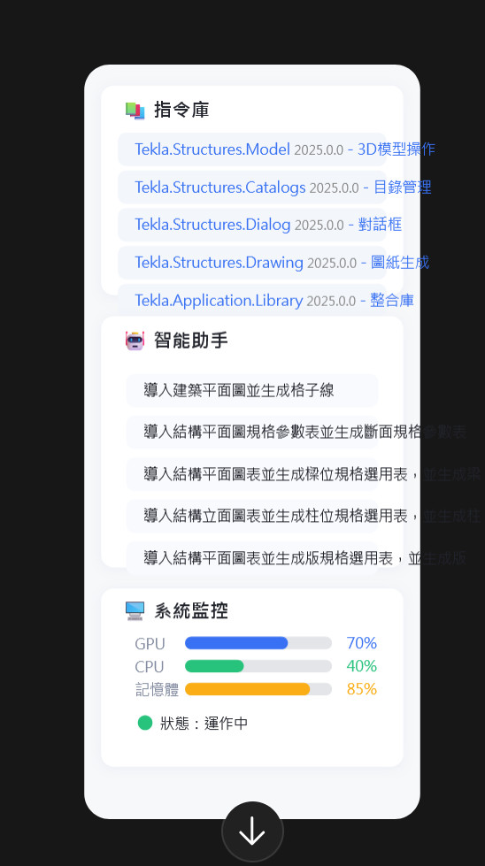

# 🦾 MCP Tekla+ AI-Assisted Modeling Platform

> 🚀 **Next-Generation AI-Powered Modeling Assistant for Tekla Structures 2025**

一個基於 AI 的智能建模平台，專為 Tekla Structures 設計，提供語音輸入、智能指令庫、即時監控等先進功能。


## ✨ 主要功能

### 🎤 即時語音輸入
- 支援中文/英文語音識別
- 即時語音轉文字
- 智能指令解析

### 🧠 AI 智能助手
- 基於大型語言模型的建模助手
- 智能參數建議
- 上下文感知對話

### 📚 智能指令庫
- 50+ 預設 Tekla 指令
- RAG (檢索增強生成) 系統
- 智能搜索與過濾

### 🏷️ 智能標籤系統
- 自動指令分類
- 參數智能識別
- 動態標籤生成

### 📊 系統監控
- 即時 GPU/CPU/記憶體監控
- 動態進度條
- 效能指標圖表

### ⚙️ 模組化設定
- MCP Server/Client 配置
- LLM 模型設定
- LM Studio 整合
- Tekla Structures 連接設定

### 🎨 現代化 UI
- Figma 風格設計
- 玻璃擬態效果
- 響應式佈局
- 深色/淺色主題

## 🛠️ 技術棧

### 前端框架
- **React 19.1.0** - 最新的 React 版本
- **TypeScript 5.8.3** - 類型安全
- **Vite 7.0.0** - 快速構建工具

### UI 框架
- **Tailwind CSS** - 實用優先的 CSS 框架
- **ShadCN UI** - 高品質組件庫
- **Framer Motion** - 流暢動畫效果
- **Lucide React** - 美觀圖標庫

### 核心功能
- **Web Speech API** - 語音識別
- **Canvas API** - 圖表繪製
- **LocalStorage** - 本地數據存儲

## 🚀 快速開始

### 環境要求
- Node.js 18.0.0 或更高版本
- npm 或 yarn 包管理器
- 現代瀏覽器（支援 Web Speech API）

### 安裝步驟

1. **克隆專案**
   ```bash
   git clone https://github.com/BIMBrain/McpTeklaPlus.git
   cd McpTeklaPlus
   ```

2. **安裝依賴**
   ```bash
   npm install
   ```

3. **啟動開發服務器**
   ```bash
   npm run dev
   ```

4. **開啟瀏覽器**
   ```
   http://localhost:5173
   ```

### 構建生產版本
```bash
npm run build
npm run preview
```

## 📁 專案結構

```
McpTeklaPlus/
├── 📱 src/
│   ├── 🧩 components/          # React 組件
│   │   ├── chat/              # 聊天介面
│   │   ├── history/           # 指令歷史
│   │   ├── layout/            # 佈局組件
│   │   ├── monitor/           # 系統監控
│   │   ├── settings/          # 設定頁面
│   │   ├── shortcuts/         # 快捷指令
│   │   ├── tags/              # 智能標籤
│   │   ├── tools/             # 工具欄
│   │   ├── ui/                # 基礎 UI 組件
│   │   ├── voice/             # 語音輸入
│   │   └── welcome/           # 歡迎頁面
│   ├── 🎣 hooks/              # 自定義 Hooks
│   ├── 📝 types/              # TypeScript 類型定義
│   ├── 🛠️ utils/              # 工具函數
│   ├── 📊 data/               # 示例數據
│   └── 🎨 assets/             # 靜態資源
├── 🌐 public/                 # 公共文件
├── ⚙️ 配置文件
└── 📚 文檔
```

## 🎯 使用指南

### 1. 語音輸入
- 點擊麥克風圖標啟用語音輸入
- 支援中文和英文語音識別
- 自動轉換為 Tekla 指令

### 2. 智能助手
- 在聊天介面中輸入問題
- AI 助手會提供建模建議
- 支援上下文對話

### 3. 指令庫
- 瀏覽預設的 Tekla 指令
- 使用搜索功能快速找到指令
- 點擊指令直接執行

### 4. 系統監控
- 查看即時系統效能
- 監控 GPU/CPU 使用率
- 追蹤記憶體消耗

### 5. 設定配置
- 配置 MCP Server 連接
- 設定 LLM 模型參數
- 調整 Tekla Structures 整合

## 🔧 開發指南

### 添加新組件
```typescript
// src/components/example/ExampleComponent.tsx
import React from 'react'

interface ExampleProps {
  title: string
}

export function ExampleComponent({ title }: ExampleProps) {
  return (
    <div className="p-4">
      <h2>{title}</h2>
    </div>
  )
}
```

### 添加新 Hook
```typescript
// src/hooks/useExample.ts
import { useState, useEffect } from 'react'

export function useExample() {
  const [data, setData] = useState(null)
  
  useEffect(() => {
    // 邏輯實現
  }, [])
  
  return { data }
}
```

## 🤝 貢獻指南

我們歡迎所有形式的貢獻！

### 如何貢獻
1. Fork 專案
2. 創建功能分支 (`git checkout -b feature/AmazingFeature`)
3. 提交更改 (`git commit -m 'Add some AmazingFeature'`)
4. 推送到分支 (`git push origin feature/AmazingFeature`)
5. 開啟 Pull Request

### 代碼規範
- 使用 TypeScript
- 遵循 ESLint 規則
- 添加適當的註釋
- 編寫測試用例

## 📄 授權條款

本專案採用 MIT 授權條款 - 查看 [LICENSE](LICENSE) 文件了解詳情。

## 🏗️ Tekla Structures 2025 Open API 整合

### 📦 核心 API 模組

本專案整合了完整的 Tekla Structures 2025 Open API，包含以下核心模組：

#### 🔧 主要 NuGet 套件


#### 🎯 功能模組

##### 📐 Model 模組 (建模核心)
```csharp
// 3D 模型操作
- 結構元件創建與修改
- 幾何計算與變換
- 材料屬性設定
- 連接與接合設計
```

##### 📚 Catalogs 模組 (目錄管理)
```csharp
// 材料與截面目錄
- 鋼材截面庫
- 混凝土等級
- 螺栓與焊接規格
- 自定義材料屬性
```

##### 🖥️ Dialog 模組 (用戶介面)
```csharp
// 對話框與表單
- 參數輸入介面
- 屬性編輯器
- 進度顯示
- 錯誤提示
```

##### 📋 Drawing 模組 (圖紙生成)
```csharp
// 工程圖與視圖
- 平面圖生成
- 立面圖創建
- 詳圖與剖面
- 尺寸標註
```

##### 🔌 Plugins 模組 (插件開發)
```csharp
// 自定義插件
- 建模工具擴展
- 自動化腳本
- 批量處理
- 工作流程優化
```

### 🏗️ 架構設計

```
MCP Tekla+ 架構
├── 🌐 前端 (React + TypeScript)
│   ├── 語音輸入介面
│   ├── AI 聊天助手
│   ├── 指令庫管理
│   └── 系統監控面板
│
├── � API 橋接層 (.NET 6/8)
│   ├── RESTful API 服務
│   ├── WebSocket 即時通訊
│   ├── 身份驗證與授權
│   └── 錯誤處理與日誌
│
└── 🏗️ Tekla API 層 (.NET Framework 4.8)
    ├── Tekla.Structures.Model
    ├── Tekla.Structures.Catalogs
    ├── Tekla.Structures.Dialog
    ├── Tekla.Structures.Drawing
    └── Tekla.Application.Library
```

### 🚀 API 服務安裝

#### 1. 創建 .NET API 專案
```bash
# 創建 API 專案目錄
mkdir TeklaApiService
cd TeklaApiService

# 創建 .NET Framework 4.8 Web API 專案
dotnet new webapi -n TeklaApiService --framework net48
cd TeklaApiService
```

#### 2. 安裝 Tekla NuGet 套件
```bash
# 安裝核心 Tekla 套件
dotnet add package Tekla.Structures.Model --version 2025.0.0
dotnet add package Tekla.Structures.Catalogs --version 2025.0.0
dotnet add package Tekla.Structures.Dialog --version 2025.0.0
dotnet add package Tekla.Structures.Drawing --version 2025.0.0
dotnet add package Tekla.Application.Library --version 2025.0.0

# 安裝相依套件
dotnet add package Tekla.Structures --version 2025.0.0
dotnet add package Tekla.Structures.Datatype --version 2025.0.0
dotnet add package Tekla.Common.Geometry --version 4.6.4
```

#### 3. 配置專案檔案
```xml
<Project Sdk="Microsoft.NET.Sdk.Web">
  <PropertyGroup>
    <TargetFramework>net48</TargetFramework>
    <UseWindowsForms>true</UseWindowsForms>
    <UseWPF>true</UseWPF>
  </PropertyGroup>

  <ItemGroup>
    <PackageReference Include="Tekla.Structures.Model" Version="2025.0.0" />
    <PackageReference Include="Tekla.Structures.Catalogs" Version="2025.0.0" />
    <PackageReference Include="Tekla.Structures.Dialog" Version="2025.0.0" />
    <PackageReference Include="Tekla.Structures.Drawing" Version="2025.0.0" />
    <PackageReference Include="Tekla.Application.Library" Version="2025.0.0" />
  </ItemGroup>
</Project>
```

### 💻 使用範例

#### 建立鋼樑
```csharp
using Tekla.Structures.Model;
using Tekla.Structures.Geometry3d;

// 連接到 Tekla Structures
var model = new Model();
if (!model.GetConnectionStatus())
{
    throw new Exception("無法連接到 Tekla Structures");
}

// 創建鋼樑
var beam = new Beam
{
    StartPoint = new Point(0, 0, 0),
    EndPoint = new Point(5000, 0, 0),
    Profile = { ProfileString = "HEA300" },
    Material = { MaterialString = "S355" }
};

// 插入到模型
beam.Insert();
model.CommitChanges();
```

#### 查詢材料目錄
```csharp
using Tekla.Structures.Catalogs;

// 獲取材料目錄
var materialCatalog = new MaterialCatalog();
var materials = materialCatalog.GetMaterialNames();

foreach (string material in materials)
{
    Console.WriteLine($"材料: {material}");
}
```

#### 生成圖紙
```csharp
using Tekla.Structures.Drawing;

// 創建圖紙
var drawingHandler = new DrawingHandler();
var drawing = new GADrawing("總平面圖", "A1");

// 創建視圖
var view = new View(
    drawing.GetSheet(),
    new Point(100, 100),
    new Point(200, 200),
    new Point(300, 300)
);

drawing.Insert();
```

#### API 控制器範例
```csharp
[ApiController]
[Route("api/[controller]")]
public class TeklaController : ControllerBase
{
    [HttpPost("create-beam")]
    public async Task<IActionResult> CreateBeam([FromBody] BeamRequest request)
    {
        try
        {
            var model = new Model();
            if (!model.GetConnectionStatus())
                return BadRequest("無法連接到 Tekla Structures");

            var beam = new Beam
            {
                StartPoint = new Point(request.StartX, request.StartY, request.StartZ),
                EndPoint = new Point(request.EndX, request.EndY, request.EndZ),
                Profile = { ProfileString = request.Profile },
                Material = { MaterialString = request.Material }
            };

            beam.Insert();
            model.CommitChanges();

            return Ok(new { BeamId = beam.Identifier.ID, Message = "鋼樑創建成功" });
        }
        catch (Exception ex)
        {
            return BadRequest($"錯誤: {ex.Message}");
        }
    }

    [HttpGet("materials")]
    public async Task<IActionResult> GetMaterials()
    {
        try
        {
            var materialCatalog = new MaterialCatalog();
            var materials = materialCatalog.GetMaterialNames();
            return Ok(materials);
        }
        catch (Exception ex)
        {
            return BadRequest($"錯誤: {ex.Message}");
        }
    }
}
```

## �🙏 致謝

- [React](https://reactjs.org/) - 用戶介面庫
- [Tailwind CSS](https://tailwindcss.com/) - CSS 框架
- [Vite](https://vitejs.dev/) - 構建工具
- [Tekla Structures](https://www.tekla.com/) - 建模軟體
- [Tekla Open API](https://developer.tekla.com/) - 開發者 API

## 📞 聯繫我們

- 📧 Email: ppson0@gmail.com
- 🐛 Issues: [GitHub Issues](https://github.com/BIMBrain/McpTeklaPlus/issues)
- 💬 Discussions: [GitHub Discussions](https://github.com/BIMBrain/McpTeklaPlus/discussions)

---

<div align="center">
  <p>🌟 如果這個專案對您有幫助，請給我們一個 Star！</p>
  <p>Made with ❤️ for the Tekla Structures community</p>
</div>
